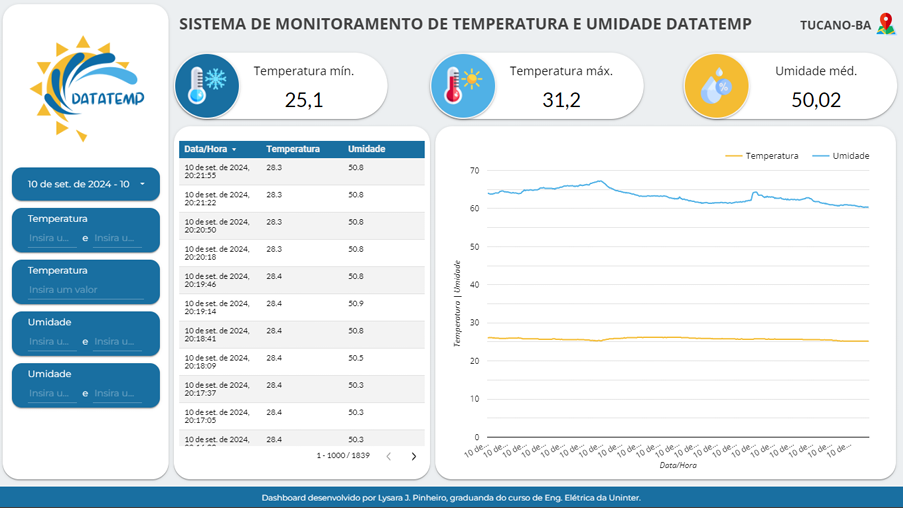
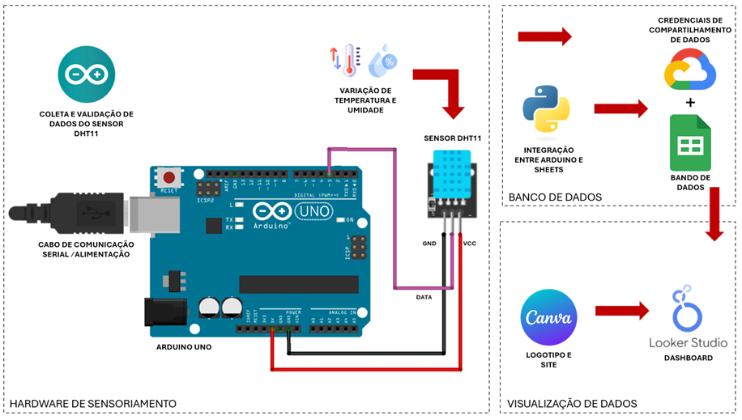
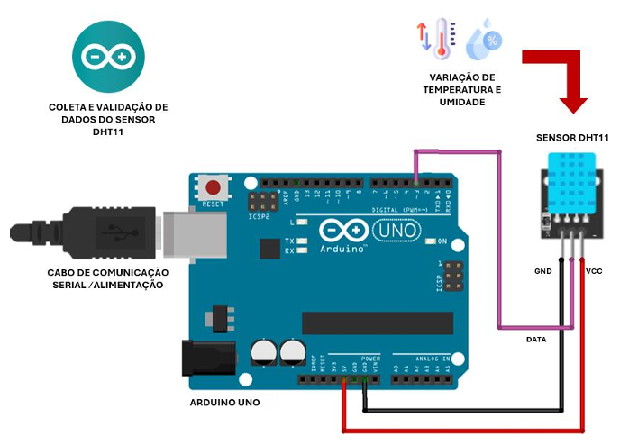
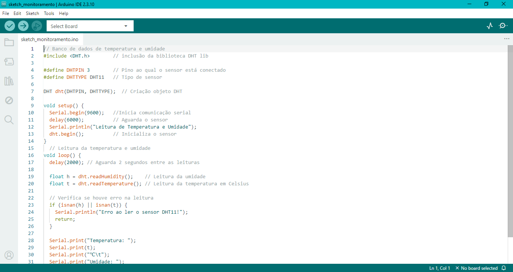
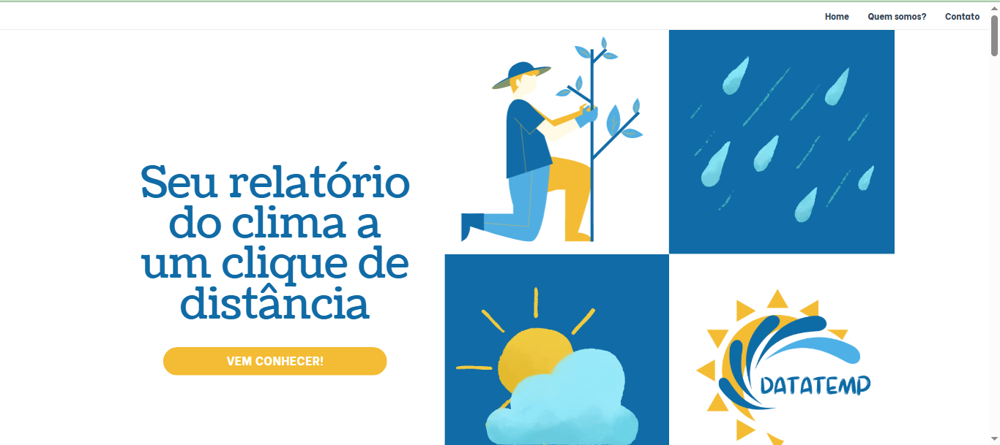

# ⛅ Pipeline IoT: Monitoramento de Temperatura e Umidade com Arduino e Google Cloud


## 📌 Sobre o Projeto
Este projeto consiste no desenvolvimento de um sistema de aquisição, processamento e visualização de dados climáticos locais. A arquitetura engloba a coleta de dados de temperatura e umidade via hardware (Arduino), a transmissão serial para um ambiente local, e o envio automatizado para a nuvem (Google Sheets) via script Python. A visualização final é realizada através de um dashboard interativo.


   
## 🏗️ Arquitetura do Projeto
O fluxo de dados foi estruturado nas seguintes etapas:

1. **Coleta (Hardware):** Um Arduino Uno e um sensor DHT11 realizam as leituras físicas do ambiente a cada 30 segundos.
2. **Interface Serial:** Os dados brutos são transmitidos via porta serial (USB) para um computador local.
3. **Ingestão e Processamento (Python):** Um script em Python, utilizando a biblioteca `pyserial`, lê os dados da porta COM, realiza a limpeza dos caracteres e formata as variáveis.
4. **Armazenamento em Nuvem:** Utilizando `gspread` e autenticação via Google Cloud Service Account, o script faz o *append* contínuo dos dados em uma planilha do Google Sheets.
5. **Visualização:** Os dados armazenados alimentam um dashboard criado no Looker Studio, disponibilizado publicamente em um site produzido no Canva.



## 🛠️ Tecnologias e Ferramentas

| Categoria | Ferramenta / Serviço | Papel na Arquitetura |
| :--- | :--- | :--- |
| **Hardware** | Arduino Uno, Módulo Sensor DHT11 | Coleta de dados físicos de temperatura e umidade do ambiente |
| **Linguagens** | C++ (Arduino IDE), Python | Lógica de controle do microcontrolador (C++) e script de processamento e envio de dados (Python) |
| **Cloud** | Google Cloud Platform (IAM/Service Accounts) | Gerenciamento de credenciais e permissões de segurança para acesso aos serviços do Google |
| **Armazenamento de dados** | Google Sheets | Banco de dados em nuvem para registrar o histórico contínuo das leituras dos sensores |
| **Visualização de dados** | Looker Studio | Criação de dashboards interativos para monitoramento e análise dos dados armazenados |
| **Site** | Canva | Design e construção da página de apresentação ou interface visual do projeto |

## ⚙️ Como executar este projeto

### Pré-requisitos
* **[Arduino IDE](https://www.arduino.cc/en/software)** instalada e placa Arduino Uno configurada.
* **[Python 3.x](https://www.python.org/downloads/)** instalado no seu sistema.
* Conta no **[Google Cloud Console](https://console.cloud.google.com/)** com as APIs do Google Drive e Google Sheets ativadas, e uma Service Account criada.

### Passo a Passo

O processo de implantação foi dividido em 4 fases para facilitar o entendimento e a reprodutibilidade da arquitetura:

#### 🔹 Fase 1: Google Cloud & Estrutura de Dados
1. **Configuração no GCP:** Acesse o [Google Cloud Console](https://console.cloud.google.com/), crie um novo projeto e ative as APIs do **Google Drive** e **Google Sheets**.
2. **Conta de Serviço (IAM):** Crie uma *Service Account* (Conta de Serviço), gere uma chave no formato **JSON** e faça o download.
3. **Segurança Local:** Mova o arquivo baixado para a pasta `python/` e renomeie-o para `credentials.json`. **Certifique-se de que este arquivo está listado no seu `.gitignore` para não expor suas credenciais.**
4. **Preparação da Planilha:** Crie uma planilha no Google Sheets com o nome `Dados_DataTemp` e adicione as seguintes colunas na primeira linha: `Data/Hora`, `Temperatura` e `Umidade`.
5. **Permissão de Acesso:** Abra o arquivo `credentials.json`, copie o e-mail da conta de serviço criado (campo `client_email`) e **compartilhe a sua planilha do Google Sheets com esse e-mail** dando permissão de "Editor".

#### 🔹 Fase 2: Montagem do Hardware & Firmware
1. **Montagem do Circuito:** Conecte o pino de dados (DATA) do sensor DHT11 ao pino digital 3 do Arduino. Em seguida, alimente o sensor conectando o seu pino VCC ao pino 5V do Arduino, e o pino GND ao GND do Arduino. 
> **⚠️ Nota:** A alimentação e a comunicação do Arduino devem ser feitas obrigatoriamente via cabo USB conectado ao computador, pois neste projeto o script Python precisa ler os dados da porta serial em tempo real para enviá-los à nuvem.



2. **Instalação de Dependências (IDE):** Abra a Arduino IDE, acesse o Gerenciador de Bibliotecas (`Ctrl+Shift+I`) e instale a biblioteca **DHT sensor library** da Adafruit.
3. **Upload do Código:** Abra o arquivo `arduino/sketch_monitoramento.ino` na Arduino IDE e faça o upload para a placa.



#### 🔹 Fase 3: Configuração do Ambiente Local (Python)
1. **Navegação:** Abra o terminal do seu computador e navegue até a pasta do script Python:
   ```bash
   cd python
   pip install -r requirements.txt

### 🔹 Fase 4: Execução e Validação do Pipeline
1. **Conexão Física:** Garanta que a placa Arduino continue conectada ao computador via cabo USB.
2. **Verificação da Porta:** Certifique-se de que a porta serial especificada no script `upload_data.py` (ex: `COM4` no Windows) corresponde à porta onde o seu Arduino está conectado.
3. **Inicialização do Script:** Execute o script para iniciar a captura e a ingestão automatizada para a nuvem:
   ```bash
   python upload_data.py

## 📊 Visualização de dados

Os dados em tempo real e o histórico de monitoramento podem ser visualizados na nossa interface pública.

   
   
🌐 **Acesse o site do projeto:** [DataTemp - Monitoramento Climático](https://datatemptucano.my.canva.site/)

## 🚀 Sugestão de melhoria

O projeto atual valida com sucesso o fluxo de dados do sensor até a nuvem usando uma conexão serial intermediada por um computador. Como melhorias de arquitetura e escalabilidade, as seguintes evoluções são sugeridas:

* **Conectividade Wi-Fi Nativa (Independência do Host):** Substituir a comunicação serial USB atual por um módulo de rede sem fio. Isso permitirá que o hardware envie os dados diretamente para o Google Cloud de forma autônoma, sem a necessidade de estar conectado a um computador.
    * *Opções de implementação:* Integração com o módulo **ESP8266 (ESP-01)** via comandos AT, ou migração do ecossistema para placas com Wi-Fi nativo, como o **ESP32** ou **Arduino Nano 33 IoT**.

* **Gerenciamento de Energia (Power Management):** Implementar modos de suspensão profunda (*Deep Sleep*) no hardware para otimizar o consumo de energia entre as leituras dos sensores, viabilizando a alimentação por baterias ou painéis solares.

* **Armazenamento Local (*Offline Buffering*):** Adicionar um módulo de cartão SD ou utilizar a memória Flash interna para reter os dados localmente em caso de queda na conexão Wi-Fi, garantindo que nenhuma telemetria seja perdida antes de reestabelecer o envio para a nuvem.
